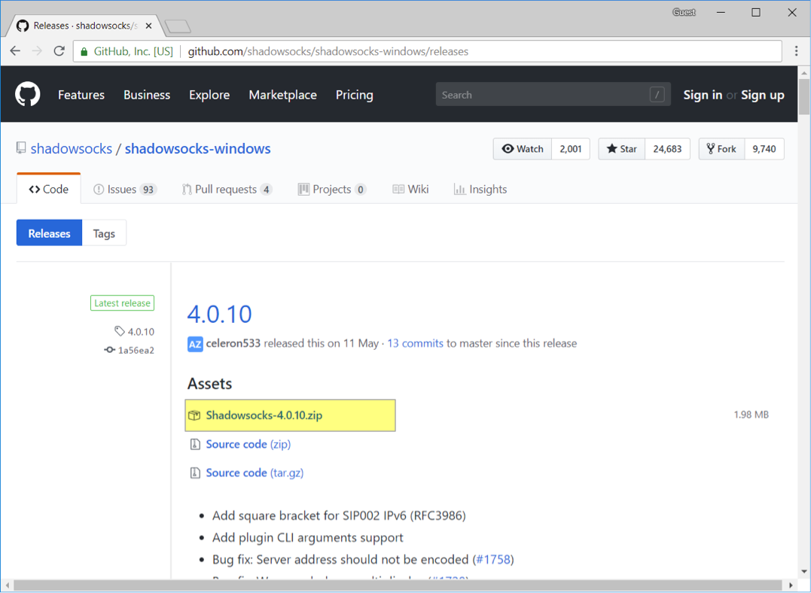
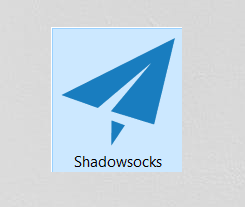
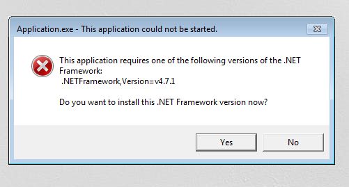
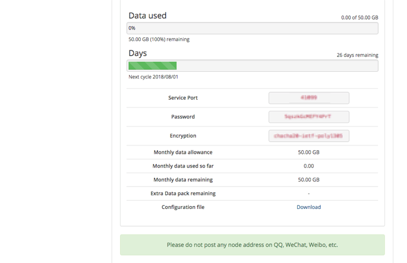
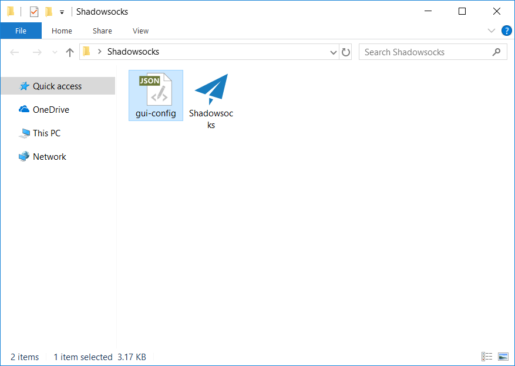
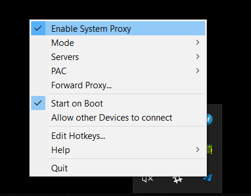
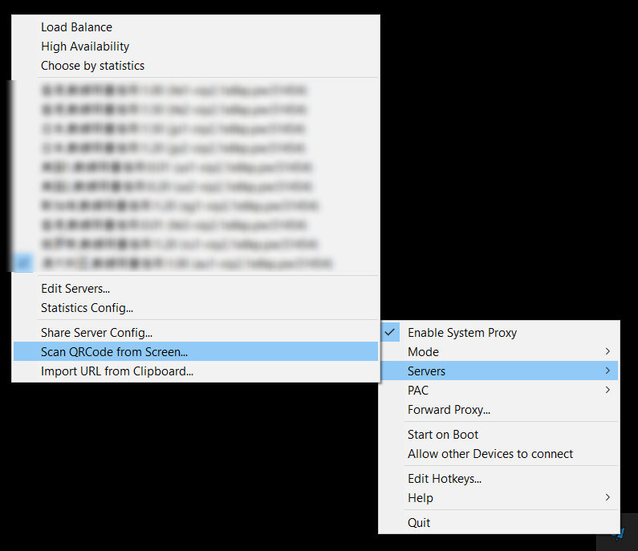
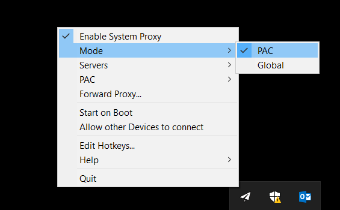
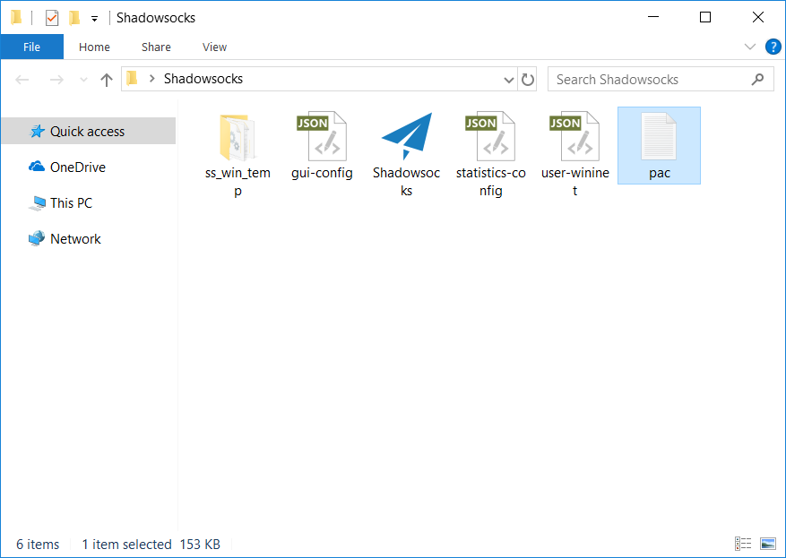

# Shadowsocks Setup Guide for Windows

## About Shadowsocks
>* Shadowsocks is an open-source encrypted proxy project, Typically, the client software will open a socks5 proxy on the machine it is run, which internet traffic can then be directed towards, similarly to an SSH tunnel.
>* Shadowsocks uses a self-designed protocol for secure communications. The encryption algorithms include AES, Blowfish, IDEA, and RC4. No handshaking is needed except for creating a TCP connection. Each request only forwards one connection and does not need to maintain the state of “always connected”, so it is relatively power-efficient on mobile devices. All traffic is algorithmically encrypted, allowing you to choose your own algorithm.
>* Clients are available on multiple major operating systems and platforms, including Windows, OSX, Android, Linux, and iOS systems and routers (OpenWrt).

## System Requirements
**Before you install, always make sure that your system meets the minimum system requirements.**

You need Windows 7 SP1 or later to run Shadowsocks. If your operating system is older, upgrade to Windows 7 SP1 or later.

## Installing Shadowsocks
Follow the instructions below to download and install Shadowsocks on Windows.

#### 1. Download the client

Go to Shadowsocks [download page](https://github.com/shadowsocks/shadowsocks-windows/releases).
Click on the latest version of `Shadowsocks-x.x.x.zip` to download (`x.x.x` is the version number).

Or download form [Client Portal](https://portal.shadowsocks.ch/index.php?rp=/download/category/1/Shadowsocks-.html)

#### 2. Unzip the client

Right-click on Shadowsocks-x.x.x.zip compressed file > "Extract all".
Click on "Browse" to select the directory where you want to unzip to> "Show extracted files when complete > "Extract".

Double-click on `Shadowsocks.exe`.

#### 3. Install the .NET Framework

After trying to run `Shadowsocks.exe`, you may see a dialog on your computer similar to the following one::

It means that your computer needs to install the .NET Framework.
Please click [here](https://www.microsoft.com/en-us/download/details.aspx?id=53345) to download the latest version of the .NET Framework.

## Configure Shadowsocks Account
#### Log in to our website (https://portal.shadowsocks.ch) and do the following:

* Click Services > My Services.
* Select your available products & services> "Configuration file" > "Downloads" > "Download configuration file for Shadowsocks Windows".
* You will get a `gui-config.json` file.

#### On your computer, do the following:

* Drag `gui-config.json` to the same directory as `Shadowsocks.exe`.

Double-click on Shadowsocks.exe to see that the node information and account have been automatically filled.
* On your system tray, right click  > "Enable System Proxy".

#### You can also add nodes individually by QR code. On your computer, do the following:

This QR code also applies to other clients.

* On your system tray, right click  > "Servers"> "Scan QR Code from Screen".
* Click "Enable System Proxy".

## Configure System Proxy Mode
* On your system tray, right click  > "Mode" > "PAC Mode".

* If you cannot access the website using the PAC mode, click [here](https://portal.shadowsocks.ch/dl.php?type=d&id=14) to download the "pac configuration file" and drag `pac.txt` in the same directory as `Shadowsocks.exe`.

## Attention
* **Global mode** means that most of the traffic in the computer will go through a proxy, and it is not recommended for daily use, because it will easily let the torrent downloads through our proxy, and causing a **serious consequence** by receiving ISP complaints.

* **Load Balance** and **High Availability** are used to spread traffic and improve usability. It is **not** for speeding up yor internet. If a node has better connection quality, it is recommended to select that server directly.

* It is recommended to use **PAC** mode, which allows automatic proxy and access to non-blocked websites without proxying. (But in the Shadowsocks Win 2.x version, the built-in GFWList link has expired, causing the PAC regulations cannot be updated.)

* You can choose to download the PAC file from our website, or when you encounter a website that cannot be accessed, edit the local PAC file to add that website address.
