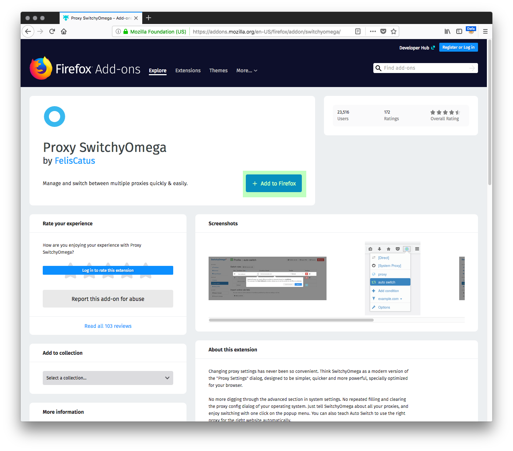
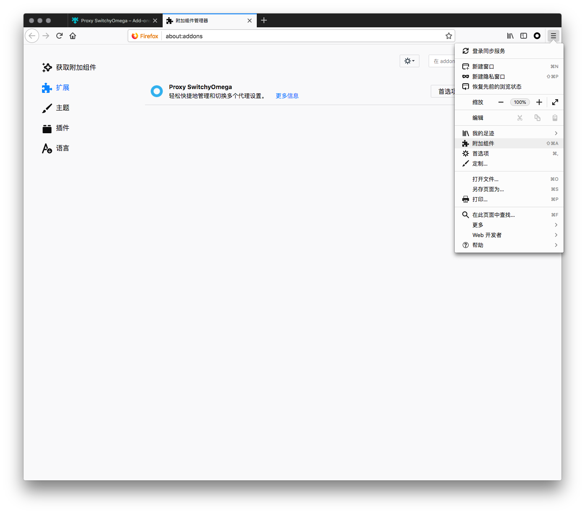
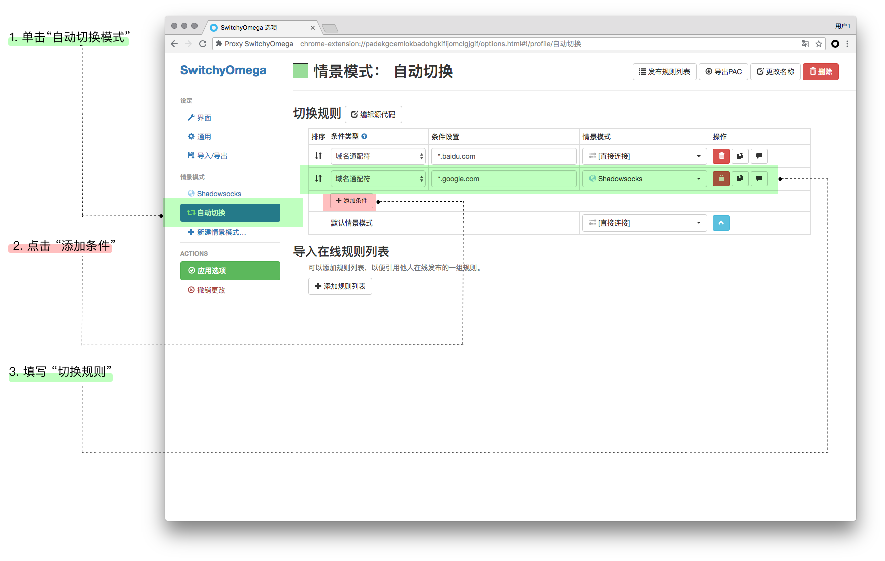

# Firefox + Proxy SwitchyOmega 设置

**这里假设您已经配置好 Shadowsocks 客户端，具体请参考**

* [Windows 下安装配置 Shadowsocks 使用教程](2-windows-setup-guide-cn.md)

* [macOS 下安装配置 Shadowsocks 使用教程](3-macos-setup-guide-cn.md)

* [Linux 下安装配置 Shadowsocks 使用教程](6-linux-setup-guide-cn.md)

**本文并不适合任何手机上的 Firefox 浏览器。**  
**本文仅适用于 Firefox Quantum （Firefox 57 以上版本）**

**Firefox 57以下版本請參考 [Firefox 配合 GFWList 实现自动切换代理 （安装 Foxyproxy-standard 扩展)](https://github.com/Shadowsocks-Wiki/shadowsocks/blob/8f8dd4541dc423c9e5f80e33079002dee0d09e0c/7-1-firefox-settings.md)**

## 安装扩展

* 首先前往[插件商店页面](https://addons.mozilla.org/en-US/firefox/addon/switchyomega/)安装 "Proxy SwitchyOmega" 扩展。

* 安装后重启 Firefox > 单击右侧 “打开菜单”图标 >  “附加组件” >  找到 "Proxy SwitchyOmega"  > 点击 ”选项“ 进行配置。

## 扩展的配置

**「推荐」** 可以直接使用本站提供的已经设置好的备份直接恢复配置。

通过下面链接下载 SwitchyOmega 的配置文件：

|Windows/Linux/macOS(ShadowsocksX)|macOS|
|:--------:|:--------:|
|[SwitchOmega + GFWList 自动切换配置文件(1080)](https://portal.shadowsocks.ch/dl.php?type=d&id=74)|[SwitchOmega + GFWList 自动切换配置文件(1086)](https://portal.shadowsocks.ch/dl.php?type=d&id=75)|
|适用于 Shadowsocks-Windows / Linux / ShadowsocksX(macOS) 等默认端口为 1080 的客户端。|适用于ShadowscoksX-NG， 默认本地端口为 1086|

* 点击 “Proxy SwitchyOmega” > "选项" > "导入/导出" > "从备份文件中恢复" 。

* 选择刚才下载的配置文件 > "打开"。
* 点击 "Switchyomega" 图标， 可以看到如下四个模式：

|连接方式|功能|
|--------|:--------:|
|直接连接|所有访问都不是使用代理。|
|系统代理|访问网站与系统的默认代理有关。|
|Shadowsocks|所有访问都使用代理。|
|自动切换|所有访问都使用代理。|

> 本站提供的配置使用了 "GFWList", 可以使大部分无法直接访问的网站默认使用代理，推荐日常使用， 在下文中会包含 "自定义配置规则"。

 

## 自定义规则

* 点击"自动切换模式" > "添加条件"。

>* 条件类型选择： "域名通配符"。

>* 条件设置填写： "*.域名".

>* 情景模式： 选 "Shadowsocks" 则经过代理， 选 “直接连接” 则不经过代理。

